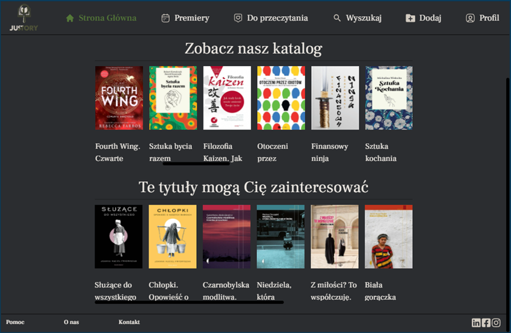

# Justory

  
  

## Description
Justory web application facilitating access to the resources of reading platforms.
The application focuses on informational features, allowing users to search for information about books, find out on which platforms the desired titles are available, and check their availability in nearby facilities through map integration. Additionally, it offers personal library management, the ability to rate books, browse upcoming releases, and a recommendation system that suggests new titles based on user preferences.
## Table of Contents

- [Project Name](#juStory)
    - [Description](#description)
    - [Table of Contents](#table-of-contents)
    - [Usage](#usage)
    - [Diagram ERD](#DiagramERD)
    - [Use Case Diagrams](#use-case-diagrams)
    - [Creators](#creators)

## Usage
- **Main Page:**
    - The home page displays the main book catalog and a list of recommended titles. Recommendations are based on the user’s previous activity and highlight books they haven’t explored yet but may find interesting.
    

     
      

- **Resource Search:**
    - Users can search for books by entering a title or author in the search bar. Alternatively, they can choose a category to view all books that belong to it.
  

     
      

- **Exploring Books:**
    - After finding an interesting book, the user can check details about its availability. The application provides information about selected title. It includes a list of platforms where the book is available — for purchase or via subscription. Users can add the book to their reading list. Administrators have additional options to edit or delete the book.
      At the bottom, a map shows nearby locations where the book might be available, based on the user’s shared location.
  

     
     
      

- **Rated List:**
    - This section displays a list of books rated by the user. Each entry shows the title, author, and the given rating. Users can also remove books from this list at any time.
  

     
      

- **Adding a Book from the Admin View:**
    - This view is available only to administrators. It allows them to add new books to the system by entering details such as title, author, ISBN, category, publisher, release date, language, description. Additionally, the form includes fields for selecting reading platforms where the book is available (Storytel, Legimi, Empik Go) and in which formats it can be accessed (ebook, audiobook, paper).
  

     
      

## DiagramERD

## Use Case Diagrams

Below are use case diagrams for different user roles:

### Admin

### Logged User

### Guest

## Creators
The project is developed by Dominika Hojniak. Contact: dominikahojniak@gmail.com